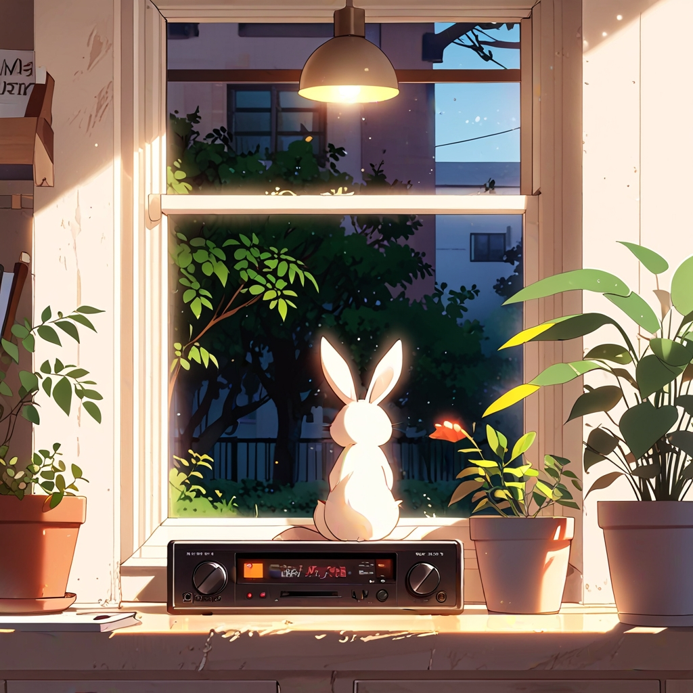

# 🎮 GameSpace

**GameSpace** is a personal project that showcases a growing collection of my **web-based games** built using **HTML**, **CSS**, and **JavaScript**. Inspired by classic retro aesthetics, this responsive game hub serves as a central place to explore, launch, and enjoy the games I've created.

---

## ✨ Features

- 🕹️ Collection of mini-games made with pure JS/HTML/CSS  
- 📱 Responsive layout powered by Bootstrap 5  
- 🚀 Smooth transitions and loading animations  
- 🎨 Retro-themed UI with custom fonts and overlays  
- 🗂️ Modular file structure — easily add or manage games  

---

## 🧪 Tech Stack

- **HTML5 / CSS3 / JavaScript**
- **Bootstrap 5** for layout & responsiveness
- **Google Fonts**: Orbitron, Press Start 2P
- Optional: [Lottie](https://lottiefiles.com/) / CSS Loaders for animated loading screens

---

## 📂 Folder Structure

